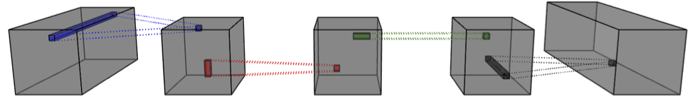

==============
TensorLy-Torch
==============

TensorLy-Torch is a Python library for deep tensor networks that
builds on top of `TensorLy <https://github.com/tensorly/tensorly/>`_
and `PyTorch <https://pytorch.org/>`_.
It allows to easily leverage tensor methods in a deep learning setting and comes with all batteries included.

- **Website:** http://tensorly.org/torch/
- **Source-code:**  https://github.com/tensorly/torch

With TensorLy-Torch, you can easily: 

- **Tensor Factorizations**: decomposing, manipulating and initializing tensor decompositions can be tricky. We take care of it all, in a convenient, unified API.
- **Leverage structure in your data**: with tensor layers, you can easily leverage the structure in your data, through Tensor Regression Layers, Factorized Convolutions, etc
- **Built-in tensor layers**: all you have to do is import tensorly torch and include the layers we provide directly within your PyTorch models!
- **Tensor hooks**: you can easily augment your architectures with our built-in Tensor Hooks. Robustify your network with Tensor Dropout and automatically select the rank end-to-end with L1 Regularization!
- **All the methods available**: we are always adding more methods to make it easy to compare between the performance of various deep tensor based methods!

Deep Tensorized Learning
========================

Tensor methods generalize matrix algebraic operations to higher-orders. Deep neural networks typically map between higher-order tensors. 
In fact, it is the ability of deep convolutional neural networks to preserve and leverage local structure that, along with large datasets and efficient hardware, made the current levels of performance possible.
Tensor methods allow to further leverage and preserve that structure, for individual layers or whole networks. 

.. image:: ./doc/_static/tensorly-torch-pyramid.png

TensorLy is a Python library that aims at making tensor learning simple and accessible.
It provides a high-level API for tensor methods, including core tensor operations, tensor decomposition and regression. 
It has a flexible backend that allows running operations seamlessly using NumPy, PyTorch, TensorFlow, JAX, MXNet and CuPy.
 
**TensorLy-Torch** is a PyTorch only library that builds on top of TensorLy and provides out-of-the-box tensor layers.

Improve your neural networks with tensor methods
------------------------------------------------

Tensor methods generalize matrix algebraic operations to higher-orders. Deep neural networks typically map between higher-order tensors. 
In fact, it is the ability of deep convolutional neural networks to preserve and leverage local structure that, along with large datasets and efficient hardware, made the current levels of performance possible.
Tensor methods allow to further leverage and preserve that structure, for individual layers or whole networks. 

In TensorLy-Torch, we provide convenient layers that do all the heavy lifting for you 
and provide the benefits tensor based layers wrapped in a nice, well documented and tested API.

For instance, convolution layers of any order (2D, 3D or more), can be efficiently parametrized
using tensor decomposition. Using a CP decomposition results in a separable convolution
and you can replace your original convolution with a series of small efficient ones: 

These can be easily perform with FactorizedConv in TensorLy-Torch.
We also have Tucker convolutions and new tensor-train convolutions!
We also implement various other methods such as tensor regression and contraction layers, 
tensorized linear layers, tensor dropout and more!

Installing TensorLy-Torch
=========================

Through pip
-----------

.. code:: 

   pip install tensorly-torch
   
   
From source
-----------

.. code::

  git clone https://github.com/tensorly/torch
  cd torch
  pip install -e .
  

